# Classroom

:::caution[Importante]

   Guia para cualquier alumno de mis cursos y cualquier alumno del Centro de Formacion Profesional N° 20

:::

## 1. Introducción a Google Classroom

Google Classroom es una plataforma que facilita la gestión de clases y tareas. A través de ella, puedes acceder a materiales, entregar tareas y comunicarte con tus profesores y compañeros.

---

## 2. Inicio de Sesión y Acceso

A. **Accede a Google Classroom**
    - Inicia sesión con tu cuenta de Google.
    - Dirígete a Google Classroom en [classroom.google.com](https://classroom.google.com/).
   

   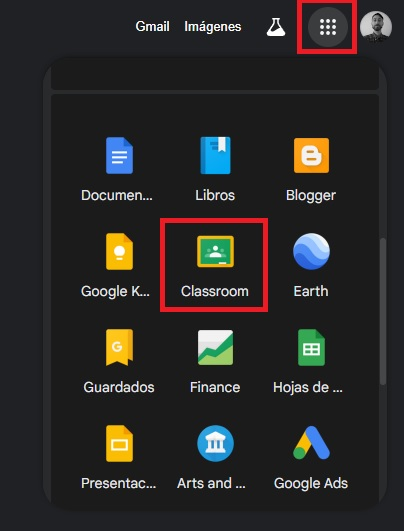 

B. **Selecciona tu Clase**
   - En la pantalla principal, verás una lista de clases a las que estás inscrito. Haz clic en la clase que deseas acceder.
   - En caso que no estes inscripto, deberas ingresar el codigo de la clase que te proporciono tu profesor.
   - En el signo + en la parte superior derecha, selecciona unirte a clase y pega el codigo que te proporciono tu profesor.

   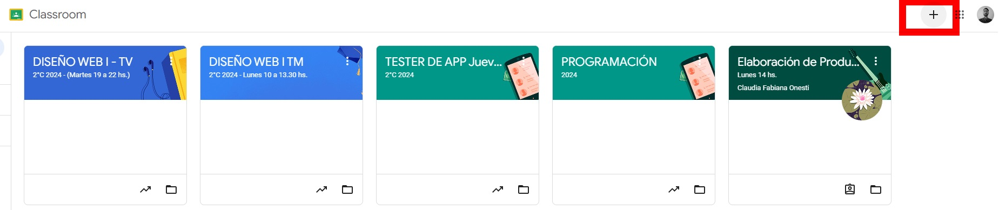

---

## 3. Navegación por la Interfaz

A. **Pantalla Principal**
   - Aquí encontrarás la pestaña de `Trabajo de clase`, `Calificaciones`, y `Personas`.

   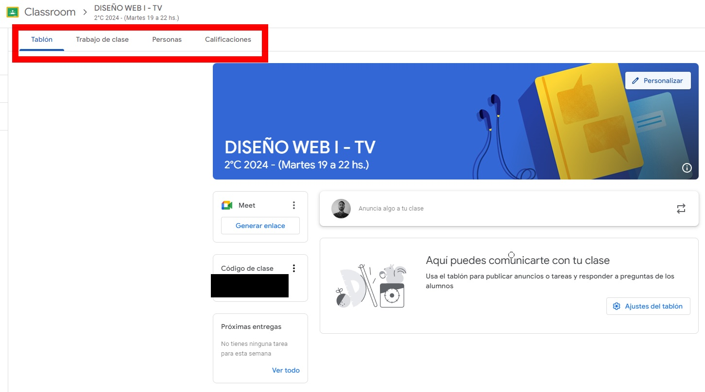

B. **Trabajo de Clase**
   - Aquí puedes ver y acceder a todas tus tareas y materiales del curso.

   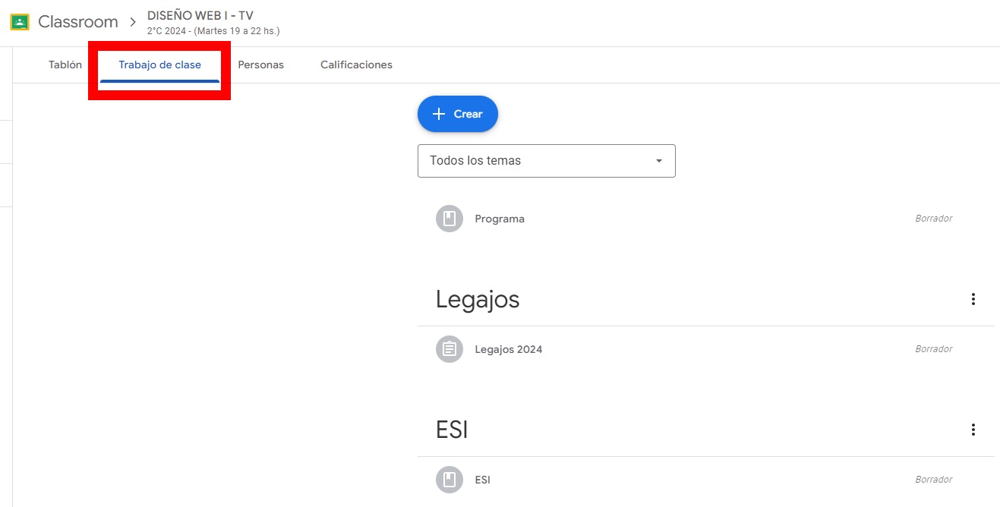

  

C. **Calificaciones**
   - Revisa tus calificaciones y comentarios de tus tareas entregadas.

   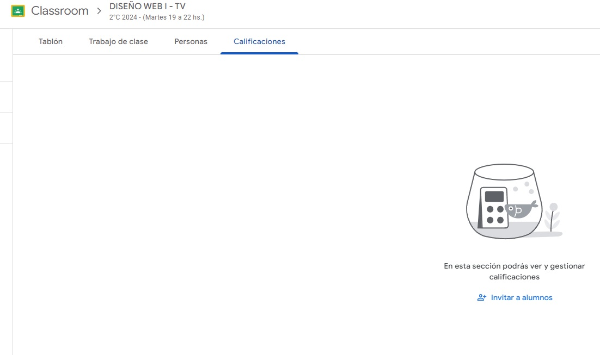

D. **Personas**
   - Consulta los nombres de tus compañeros y profesores.

   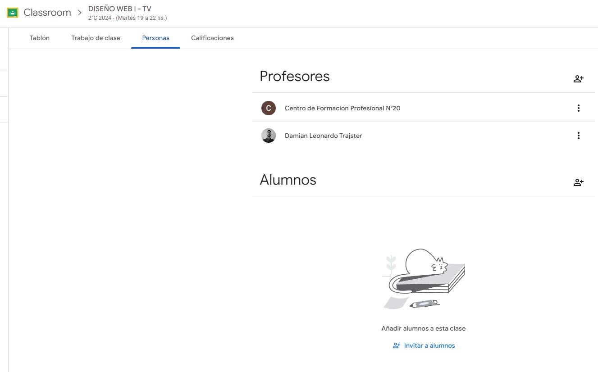

---

## 4. Acceso a Tareas y Materiales

A. **Ver Tareas**
   - En la pestaña `Trabajo de clase`, haz clic en la tarea para ver los detalles.
   - Esto es depende de la configuracion de tu profesor, puede ser que te muestre la tarea directamente o te muestre un enlace a un documento o video.
   - Igualmente, te llegara una notificacion a tu correo electronico.
   - Impotante a tener en cuenta la fecha de entrega de la tarea.

   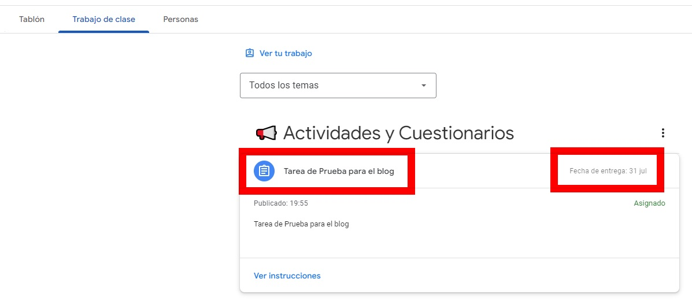

B. **Acceder a Materiales**
   - Los materiales como documentos, videos o enlaces estarán disponibles en la sección `Trabajo de clase`.
   - Todo depende como lo haya ordenado tu profesor.

   :::tip[Tips Importante]
      Para descargar cualquier archivo, se debe hacer clic en los 3 puntitos que aparecen en la parte superior derecha del archivo, abrir en una nueva ventana y luego descargar.
   :::

   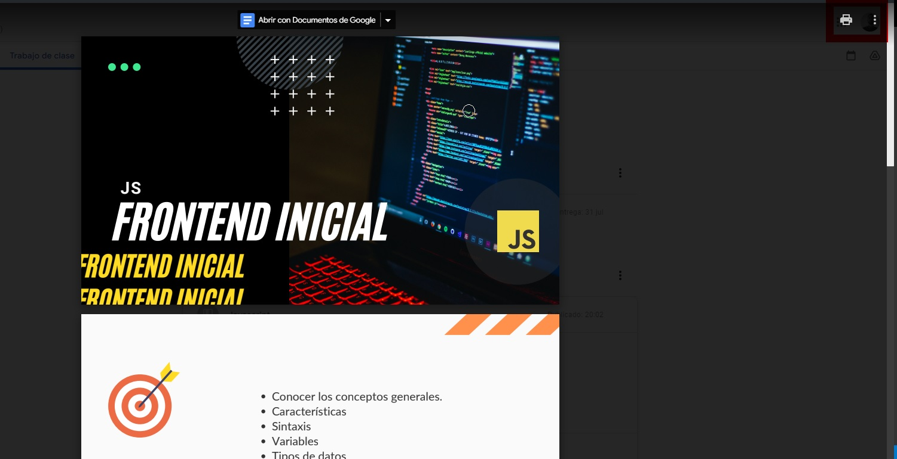

---

## 5. Cómo Entregar Tareas

A. **Abrir la Tarea**
   - Haz clic en la tarea que necesitas entregar.
   - Asegúrate de leer las instrucciones y adjuntar los archivos necesarios.
   - Haz clic en Ver instrucciones.

   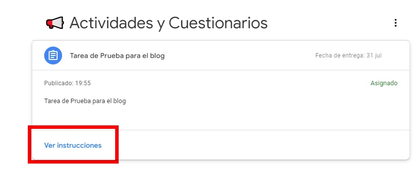

B. **Adjuntar Archivos**
   - Usa el botón `Añadir o crear` para subir archivos desde tu computadora o Google Drive.

   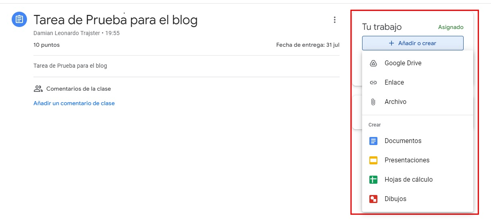

C. **Entregar la Tarea**
   - Una vez que hayas adjuntado todos los archivos necesarios, haz clic en `Entregar`.
   - Puedes añadir un comentario o mensaje antes de enviar la tarea.

   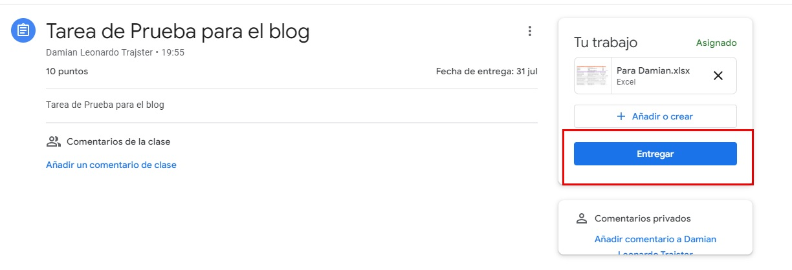

---

## 6. Comunicación con el Profesor y Compañeros

1. **Publicar en el Muro**
   - Usa el `Tablon` para publicar mensajes que tus compañeros y profesor pueden ver.

2. **Enviar Mensajes Privados**
   - En la pestaña `Personas`, puedes enviar mensajes directos a tu profesor o compañeros.

---

## 7. Uso de Herramientas Adicionales

1. **Google Meet**
   - Participa en videollamadas programadas desde el `Stream`.

 

2. **Google Drive**
   - Utiliza Google Drive para almacenar y compartir tus documentos con tu clase.

---

## 8. Legajos

:::danger[Legajos]

   Muy importante Subir la documentacion pertinente en el apartado de **Legajos**, en caso de no hacerlo, no se podra realizar el certificado de finalizacion.

   Leer el apartado:  **5. Cómo Entregar Tareas** que es exactamente igual a subir la documentacion en el apartado de **Legajos**.

:::

## Consejos Adicionales

- **Revisa tu clase regularmente** para no perderte actualizaciones importantes.
- **Configura notificaciones** para estar al tanto de nuevas tareas y mensajes. 
- **Mira este video tutorial** para aprender más sobre Google Classroom: [Tutorial Google Classroom](https://www.youtube.com/watch?v=MycvBy8LSN4&t=672s)
